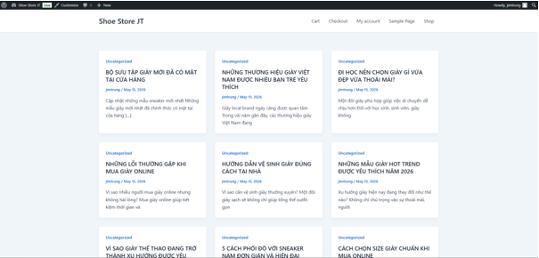
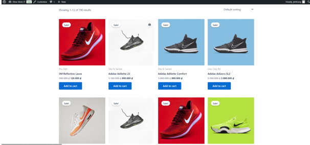
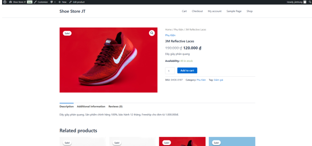
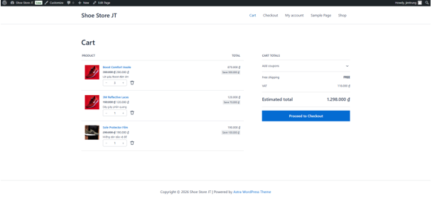
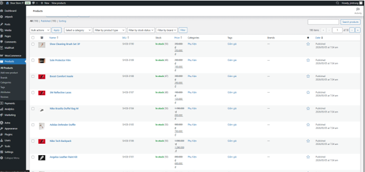

# Website Bán Giày Sử Dụng WordPress

---

# Giới Thiệu Website/Hệ Thống

Website bán giày trực tuyến được xây dựng bằng WordPress nhằm hỗ trợ khách hàng tìm kiếm, tham khảo và mua sắm các sản phẩm giày một cách nhanh chóng và thuận tiện.

Hệ thống cung cấp đầy đủ các chức năng cơ bản của một website thương mại điện tử như:

- Hiển thị danh sách sản phẩm
- Tìm kiếm và lọc sản phẩm
- Xem chi tiết sản phẩm
- Thêm sản phẩm vào giỏ hàng
- Đặt hàng trực tuyến
- Quản lý sản phẩm và đơn hàng
- Quản lý tài khoản khách hàng
- Quản trị website thông qua trang Admin WordPress

Website được thiết kế với giao diện thân thiện, dễ sử dụng và tương thích trên nhiều thiết bị khác nhau.

---

# Danh Sách Thành Viên

| STT | Họ Và Tên | Vai Trò |
|-----|------------|----------|
| 1 | Nguyễn Hải Trung | Developer | 

---

# MSSV Từng Thành Viên

| Họ Và Tên | MSSV |
|-----------|------|
| Nguyễn Hải Trung | 23810310044 | 

---

# Phân Công Nhiệm Vụ

## Nguyễn Hải Trung
- Phân tích yêu cầu hệ thống
- Cài đặt và cấu hình WordPress
- Thiết kế giao diện website
- Quản lý và phát triển chức năng website
- Thiết kế giao diện sản phẩm
- Responsive website
- Tối ưu trải nghiệm người dùng
- Kiểm thử hệ thống
- Viết tài liệu báo cáo
- Hỗ trợ deploy website

---

# Công Nghệ Sử Dụng

## Website
- WordPress

## Plugin
- WooCommerce
- Astra
- SePay

## Ngôn Ngữ
- PHP
- HTML
- CSS
- JavaScript

## Database
- MySQL

## Công Cụ Khác
- XAMPP
- Visual Studio Code
- Git & Github

---

# Hướng Dẫn Cài Đặt

## 1. Clone Repository

```bash
git clone https://github.com/jimtrung/web-ban-giay.git 
```

## 2. Copy source code vào thư mục htdocs của XAMPP

Ví dụ:

```text
C:\xampp\htdocs\web-ban-giay
```

## 3. Khởi động Apache và MySQL trong XAMPP

## 4. Import database

- Mở phpMyAdmin
- Tạo database mới
- Import file `web-ban-giay.sql` vào database

## 5. Cấu hình file wp-config.php

Chỉnh sửa:

```php
define('DB_NAME', 'database_name');
define('DB_USER', 'root');
define('DB_PASSWORD', '');
define('DB_HOST', 'localhost');
```

---

# Hướng Dẫn Chạy Project

## Chạy Website

- Khởi động Apache và MySQL bằng XAMPP
- Truy cập:

```text
http://localhost/web-ban-giay
```

## Truy cập trang Admin

```text
http://localhost/web-ban-giay/wp-admin
```

---

# Tài Khoản Demo

## Admin

- Username: jimtrung 
- Password: Trung@123 

## User

- Username: user
- Password: 123456

---

# Hình Ảnh Minh Họa Hệ Thống

## Trang Chủ



## Trang Sản Phẩm



## Trang Chi Tiết Sản Phẩm



## Trang Giỏ Hàng



## Trang Quản Trị



---

# Video Demo

Link video demo:  
https://youtube.com/

---

# Link Deploy Online

Website Online:  
https://nguyenhaitrung.id.vn/

---

# Giấy Phép

Dự án được thực hiện phục vụ mục đích học tập và nghiên cứu.
